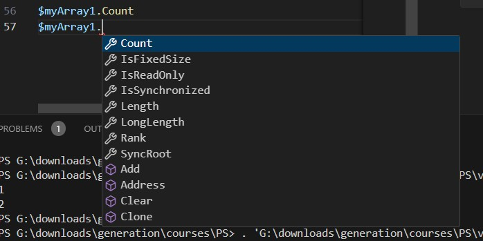
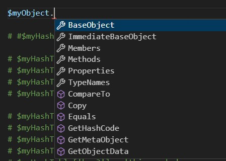

# Intro to PowerShell

PowerShell provides an environment for executing commands, and creating powerful scripts allowing you to automate complex tasks. 

PowerShell has been included in Windows for several generations, and was built upon the `.Net Framework`, which is a software framework for developers creating software for, primarily, Windows. It provides libraries for creating user interfaces, accessing data, connecting to DBs, communicating over the network, and lots of functionality which an app' might require.

As user requirements evolved, for example the need to minimise the O/S footprint for security, or to maximise resources for containers, some newer O/S versionsm such as Windows Nano Server, do not provide all of the functionality for .Net Framework, so a new version called `.Net Core`, which has now just become `.Net` (v9 is the latest at time of writing).

At this point there are two current versions of PowerShell, PowerShell 5 is included with Windows distributions by default and was built upon the legacy .NET Framework, PowerShell 7 is built upon .NET Core, and can be installed alongside version 5. I wouldn't be surprised if at some point in the future they're consolidated.

## Variables

We use the `$` character to declare, recall, and work with variables.

```powershell
$myVar=12

$myVar
```

PowerShell is not normally case sensitive, but by convention we declare variables using camelCase.

Once declared you can just recall the variable with it's name, we don't require a print or echo statement.

Similar to Python, PowerShell uses *dot notation* to access methods and properties of objects.



PowerShell recognises various data types which we're familiar with from other environments, use the `GetType` method to view the type of object. 

```powershell
$myVar1=12
$myVar2="12"
$myVar3=1.2
$myVar1.GetType()
$myVar2.GetType()
$myVar3.GetType()
```

We can utilise lots of familiar mathematical operators

```powershell
$myVar1=10
$myVar2=3

$myVar1 + $myVar2
$myVar1 - $myVar2
$myVar1 * $myVar2
$myVar1 / $myVar2
$myVar1 % $myVar2

$varSum = $myVar1 + $myVar2

$varSum
```

However, comparison operators do not work as expected, we do not use: <, >, ==, etc. instead we use the following:

|Comparison         |Syntax |
|-------------------|-------|
|Equal              |-eq    |
|Equal (case sensitive) |-ceq    |
|Not equal          |-ne    |
|Not equal (case sensitive) |-cne    |
|Greater            |-gt    |
|Greater or equal   |-ge    |
|Less               |-lt    |
|Less or equal      |-le    |

```powershell
($myVar3 -eq $myVar2)
```

There are many other operators available, such as `like` and `not like`, `replace`, and more. We can also use regular expressions, but these are out of scope for this Introduction module.

We can also assign Boolean values to variables, not these are pre-defined values - do not create variables called `$true` or `$false`.

```powershell
$myVar1=$true
$myVar2.GetType()
```

Booleans can also be returned by expressions:

```powershell
$myVar3=3
$myVar2=4

($myVar3 -eq $myVar2)

$myResult=($myVar3 -eq $myVar2)

$myResult.GetType()
```

By default PS will identify the data type automatically, but we can define it explicitly, for example:

```powershell
[int]$myVar2=1.3
[int]$myVar3=1.7

$myVar2
$myVar3
```

## Arrays

### Creating and Recalling Arrays

Arrays can be used to assign multiple values to a varible, however there are some limitations we'll explore. 

In brief, an Array is similar to a Python Tuple, so we'll look at a  PowerShell feature that operates like a List next.

```powershell
$myArray1=@()
$myArray1.GetType()
```

The `GetType` method against your array will return a `System.Array` type.

Now let's redeclare the array, but populate it with some strings, then we'll call the array, get a count of the items, and the lenth of the array:

```powershell
$myArray1=@('Frankie','Scout','Weasley','Noche')
$myArray1
$myArray1.Count
$myArray1.Length
```
*Notice: As we've previously seen with single value variables, if you simply call the array, the whole array will be returned. No need for **print** or **echo**.*

As you type the array name and the dot, VSC displays some of the methods, and properties for this object; Below we can see both `Count` and `Length` as available properties for our array.


In VSC try typing your variable name, then a dot, then any letter, to see a list of available functions. 

One option in the above screenshot is `IsFixedSize`, this will return a boolean, in this case `$true`. This is important to note, and we will return to why it's important shortly.

Similar to lists and tuples in Python, items in the array are indexed, and can be recalled using their index number. *Remember the **off-by-one** behaviour, index numbers start at zero.*

```powershell
$myArray1=@('Frankie','Scout','Weasley','Noche')

$myArray1[1]
```

### Adding Items to an Array

When may have spotted the `Add` method in the screenshot


Unfortunately this doesn't work as you might expect, the following will return an error

```powershell
$myArray1=@('Frankie','Scout','Weasley','Noche')

$myArray1.Add('New_pet')
```

If you try it the error returned states that "...Collection was of a fixed size."

This comes back to the `IsFixedSize` property, and also the point we made about arrays being similar to Python' tuples. If you want to add a new item to an array it needs to be destroyed and recreated.

```powershell
$myArray1=@('Frankie','Scout','Weasley','Noche')

$myArray1 = $myArray1 + "new_pet"

$myArray1

# Another method

$myArray1 += "too_many_pets"

$myArray1
```

On a small scale destroying/creating arrays isn't a big deal, but it does have a performance impact, which we'll look at shortly.

`Remove` has the same problem, so use

```powershell
$myArray1=@('Frankie','Scout','Weasley','Noche')
$myArray1

$myArray1 = $myArray1 -ne "Frankie"
$myArray1
```

## Array Lists

As we mentioned, arrays work like tuples, we cannot add or remove items, instead we have to recreate with or without the relevant item. Array lists work more like lists, allowing you to add and remove as needed. They syntax for creating them is a bit trickier, but the flexibility and performance benefit means that many PS developers and admins will use Array Lists by default.

Create a list array with the following command

```powershell
$myArrayList1 = New-Object -TypeName System.Collections.ArrayList
$myArrayList1.GetType()
$myArrayList1
```

Array lists allow you to add and remove items as you would expect, with very similar syntax to Python. As you add items PS returns the index number of the added item - you can disable this behaviour if needed.

```powershell
$myArrayList1 = New-Object -TypeName System.Collections.ArrayList
$myArrayList1.Add("Frankie")
$myArrayList1.Add("Scout")
$myArrayList1
```

We can also add a range of items:

```powershell
$myArrayList1 = New-Object -TypeName System.Collections.ArrayList
$myArrayList1.Add("Frankie")
$myArrayList1.Add("Scout")
$myArrayList1.AddRange(@("Noche","Weasley"))
$myArrayList1
```

We can also remove items with similar syntax

```powershell
$myArrayList1 = New-Object -TypeName System.Collections.ArrayList
$myArrayList1.AddRange(@("Frankie","Scout","Noche","Weasley"))
$myArrayList1
$myArrayList1.Remove("Frankie")
$myArrayList1
$myArrayList1.RemoveAt(0)
$myArrayList1
$myArrayList1.RemoveRange(0,2)
$myArrayList1
```

The RemoveRange method takes 2 inputs, the first is the index number to start at, the second is how many items to remove. 

### Performance Comparison

To illustrate the performance difference between arrays and array lists, lets start by creating an empty array and array list, then populating them - **Copy, but don't run the below code yet**

```powershell
$myArray = @()
$myArrayList = New-Object -TypeName System.Collections.ArrayList

Measure-Command -Expression {@(0..20000).ForEach({$myArray += $_})}

Measure-Command -Expression {@(0..20000).ForEach({$myArrayList.Add($_)})}
```

Run the first Measure-Command cmdlet, comment out the second one (#), Measure-Command will return statistics about how long it took for the defined expession to execute. Once the first one has completed (it may take a minute on an older CPU) comment it out and run the second one, then compare the results. 

If you have a fast CPU try increasing the number of repetitions. For example, on my system if I increase the number to 50000, destroying and recreating an array 50000 times takes 22.6 seconds, but adding 50000 items to an array list takes just 2.4 seconds, more than 10x faster.

## Hash Tables

Hash tables are basically PowerShell's version of dictionaries, just slightly different syntax

```powershell
$myHashTable = @{
    Name = "Scout"
    Age = 2
    Length = 86.2
    IsHuman = $false
}

$myHashTable
```
Notice when you recall the Hash table it doesn't just return some text, but an object, categorised, and appropriately formatted


Items in a Hash table are not indexed like Arrays and Array Lists, therefore the items may be retrieved in a different order than they were added.

Once created we can interact with the Hash table similarly to Python as well. We can retrieve just keys, just values, or specific values from a key

```powershell
...

$myHashTable.Keys
$myHashTable.Values
$myHashTable.IsHuman
# Another way to retrieve the value for a key: $myHashTable["Length"]
```

The `ContainsKey` method will return a boolean if a value exists in the Hash table or not

```powershell
...

$myHashTable.ContainsKey("Scout")
```

There are multiple ways to add new key-value pairs

```powershell
...

$myHashTable.Add("key1","value1")
$myHashTable['key2'] = 'value2'
$myHashTable.key3="value3"

$myHashTable
```

The last method of adding a new key value pair can also be used to redefine a value

```powershell
...

$myHashTable.key1="original_value"
$myHashTable

$myHashTable.key1="new_value"
$myHashTable
```

## Custom Objects

As we previously covered, PowerShell works with objects, compared to CMD which works with strings.

The cmdlets, results, variables, aliases, etc. that we've worked with are all objects. We can make our own custom objects that represent entities in your environment, which you can then work with, manipulate, and process.

Create your object as follows

```powershell
$myObject = New-Object -TypeName PSCustomObject
$myObject.GetType()
```

Once created you can add properties to the object

```powershell
...

Add-Member -InputObject $myObject -MemberType NoteProperty -Name 'Name' -value 'Frankie'
Add-Member -InputObject $myObject -MemberType NoteProperty -Name 'Breed' -value 'Mini-Dachshund'
Add-Member -InputObject $myObject -MemberType NoteProperty -Name 'Age' -value 2

$myObject
```

If you call your object and use dot notation, you'll see a number of methods that are already available against your object



View more details about the object's methods and properties with

```powershell
...

Get-Member -InputObject $myObject
```

## Pipes

Pipes (or pipelining) are very common in PS, used to chain commands together to carry out complex, multi-stage processing on objects.

We're going to use the `spooler` service to practice using the pipe, this service which manages print jobs. Not many people need to regularly print these days, so it shouldn't cause any problems, but if you do, remember to turn it back on at the end.

If you're going to reference a value more than once, you should assign it to a variable

```powershell
$svcName = 'Spooler'

Get-Service -Name $svcName
```

We can pipe this service to carry out simple operations

```powershell
$svcName = 'spooler'

Get-Service -Name $svcName | Stop-Service
Get-Service -Name $svcName
Get-Service -Name $svcName | Start-Service
Get-Service -Name $svcName
```

Note: The commands above may return a `cannot open 'spooler' service` error, due to permissions. If so, open an elevated (Admin) PowerShell window in the same location as the file, and run it as a script `.\FileName.ps1`. You may also need to change your ExecutionPolicy check it with `Get-ExecutionPolicy` and if restricted, change it with `Set-ExecutionPolicy bypass`.

How could you use the skills so far to create a script which will manage multiple service for us?

```powershell
$svcList = New-Object -TypeName System.Collections.ArrayList
$svcList.AddRange(@('spooler','w32time'))

$svcList | Get-Service
$svcList | Stop-Service
$svcList | Get-Service
$svcList | Start-Service
$svcList | Get-Service
```

Or return a status summary?

```powershell
$svcList = New-Object -TypeName System.Collections.ArrayList
$svcList.AddRange(@('spooler','w32time'))

$svcList | Get-Service | ForEach-Object {Write-Output "Service: $($_.DisplayName) is currently $($_.status)"}
```

Challenge: Use the above syntax to return a message about your custom object. Example solution at the end.

## If Statements

If statements follow the same logic that we've used in Python and Bash. For these examples I've created a text file, added some data to it, and provided the absolute path to the file in the `$filePath` variable. You could also use a relative path if the file is in the same directory as your PS script.

```powershell
$filePath = "G:\downloads\generation\courses\PS\SomeData.txt"

if(Test-Path -Path $filePath){
    $Data = Get-Content -Path $filePath
    # $Data.Count
}else{
    Write-Output "File `"$filePath`" does not exist!"
}
```

Let's do a little more processing in our output

```powershell
if(Test-Path -Path $filePath){
    $Data = Get-Content -Path $filePath
    $lineCount = $Data.Count
    Write-Output "There are $lineCount lines in the file"
}else{
    Write-Output "File `"$filePath`" does not exist!"
}
```

Here's an example using `elseif` to add more outputs. Note: in this example my text file contains pizza orders.

```powershell
$Data = Get-Content -Path $filePath
$pizzaOrder = $Data[0]

if($pizzaOrder -eq 'Pepperoni'){
    Write-Output "$pizzaOrder is a classic"
}elseif($pizzaOrder -eq 'Ham & Pineapple'){
    Write-Output "$pizzaOrder, salty and sweet, nice"
}elseif($pizzaOrder -eq 'Quattro Formagio'){
    Write-Output "$pizzaOrder, can't have enough cheese!"
}else{
    Write-Output "You get the idea, $pizzaOrder embedded in a msg"
}
```

Try creating your own if/elseif/else statement from scratch, with a different scenario from these examples.

## Foreach

I've dropped a few examples of `foreach` in previous sections, in a nutshell, it's the PowerShell equivalent of a `for loop`.

The first example uses a `foreach` loop to iterate through each item in the list, and print each fruit to the console.

```powershell
$fruits = @("Apple", "Banana", "Cherry", "Date", "Elderberry")

foreach ($fruit in $fruits) {
    Write-Output "Fruit: $fruit"
}
```
What do you think is happening here?

```powershell
$files = Get-ChildItem -Path "G:\downloads\generation\courses\PS\records\" -Filter "*.txt"

foreach ($file in $files) {
    Write-Output "Processing file: $($file.Name)"
}
```

- `Get-ChildItem` is run against the directory specified by `-Path`, and the returned objects are stored in the variable `$files`
- The `foreach` loop, just like in Python, uses another variable `$file` to hold each individual object on each iteration of the loop.
- In each loop the string "Processing file:" and the `Name` property of the object is called from `$file` and added to the string

    ### Aliases

    Similar to Bash, Python, and SQL, PowerShell supports aliases. Typing `dir` into command prompt lists the content of the current directory. PowerShell commands use a Verb-Noun format, `dir` doesn't fit the structure. The equivalent command in PowerShell is `Get-ChildItem`, but `dir` is aliased to `Get-ChildItem`, so typing `dir` will work.

    View configured aliases with `Get-Alias`

**Challenge:** Combine your knowledge from previous sections to write a `foreach` loop containing an `if` statement - Example solution at the end.

## For Loops

The `for` loop is very similar to `foreach`, except that it is used when you want to loop a set number of times, or use a counter.

```powershell
for ($i = 1; $i -le 50; $i++) {
    Write-Output "Iteration $i"
}
```

For can also loop through an array by accessing items via the index number

```powershell
$petNames = @('Frankie','Scout','Noche','Weasley')

for ($i = 0; $i -le $petNames.Length; $i++) {
    Write-Output $petNames[$i]
}
```

There is one important difference between `for` and `foreach`, which is that `for` loops can modify the items in an array.

In this example the items in the array are modified

```powershell
$petNames = @('Frankie','Scout','Noche','Weasley')

for($i = 0; $i -lt $petNames.Length; $i++){
    $petNames[$i]+=' is sleepy'
}

$petNames
```

However, in this example using `foreach`, the original array items are not modified.

```powershell
$petNames = @('Frankie','Scout','Noche','Weasley')

foreach($pet in $petNames){
    $pet+=' is hungry'
    Write-Output $pet
}

$petNames
```

Use `for` and `foreach` accordingly based on your needs, if the integrity of the array items needs to be maintained, use `foreach`.

## While Loops

The final loop we'll look at is the while loop, which again, just like in Python and Bash, simply loops until a condition is met, such as a counter, or a boolean flag. 

```powershell
$counter = 1

while ($counter -le 5) {
    Write-Output "Count: $counter"
    $counter++
}
```

## Custom Objects with Pipes - Example Solution

```powershell
$sausage1=New-Object -TypeName PSCustomObject

Add-Member -InputObject $sausage1 -MemberType NoteProperty -Name 'Name' -Value 'Scout'
Add-Member -InputObject $sausage1 -MemberType NoteProperty -Name 'Age' -Value 2
Add-Member -InputObject $sausage1 -MemberType NoteProperty -Name 'Breed' -Value 'Mini-Dachshund'
Add-Member -InputObject $sausage1 -MemberType NoteProperty -Name 'Colour' -Value 'Shaded-Red'
Add-Member -InputObject $sausage1 -MemberType NoteProperty -Name 'Fav_food' -Value 'Sausages'
Add-Member -InputObject $sausage1 -MemberType NoteProperty -Name 'pronoun' -Value 'he'

$sausage2=New-Object -TypeName PSCustomObject

Add-Member -InputObject $sausage2 -MemberType NoteProperty -Name 'Name' -Value 'Frankie'
Add-Member -InputObject $sausage2 -MemberType NoteProperty -Name 'Age' -Value 5
Add-Member -InputObject $sausage2 -MemberType NoteProperty -Name 'Breed' -Value 'Mini-Dachshund'
Add-Member -InputObject $sausage2 -MemberType NoteProperty -Name 'Colour' -Value 'Shaded-Red'
Add-Member -InputObject $sausage2 -MemberType NoteProperty -Name 'Fav_food' -Value 'Venison'
Add-Member -InputObject $sausage2 -MemberType NoteProperty -Name 'pronoun' -Value 'she'

$sosigList=New-Object -TypeName System.Collections.ArrayList
$sosigList.AddRange(@($sausage1,$sausage2))

$sosigList | Foreach-Object{Write-Output "This $($_.Breed) is called $($_.Name) and $($_.pronoun) is $($_.Age) years old"}
```

## `if` Statement in a `foreach` loop - Example Solution

```powershell
$filePath = "G:\downloads\generation\courses\PS\SomeData.txt"
$pizzas = Get-Content -Path $filePath

foreach($pizza in $pizzas){
    if($pizza -eq 'Pepperoni'){
        Write-Output "$pizza is a classic"
    }elseif($pizza -eq 'Ham & Pineapple'){
        Write-Output "$pizza, salty and sweet, nice"
    }elseif($pizza -eq 'Quattro Formagio'){
        Write-Output "$pizza, can't have enough cheese!"
    }else{
        Write-Output "You get the idea, $pizza embedded in a msg"
    }
}
```